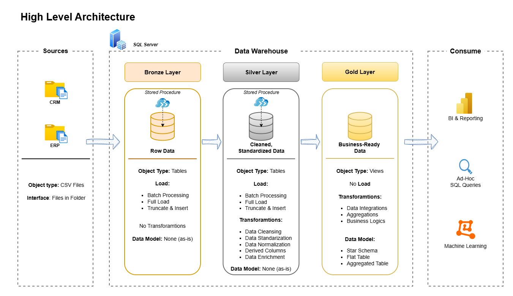

# Data Warehouse Project

Welcome to the **Data Warehouse Project** repository! 🚀  
This project demonstrates a comprehensive data warehousing and analytics solution, from building a data warehouse to generating actionable insights. Designed as a portfolio project, it highlights industry best practices in data engineering and analytics.

---
## 📖 Project Overview

This project involves:

1. **Data Architecture**: Designing a Modern Data Warehouse Using Medallion Architecture **Bronze**, **Silver**, and **Gold** layers.
2. **ETL Pipelines**: Extracting, transforming, and loading data from source systems into the warehouse.
3. **Data Modeling**: Developing fact and dimension tables optimized for analytical queries.
4. **Analytics & Reporting**: Creating SQL-based reports and dashboards for actionable insights.

🎯 This repository is an showcase expertise in:
- SQL Development
- Data Architect
- Data Engineering  
- ETL Pipeline Developer  
- Data Modeling  
- Data Analytics

.png)

---
## 🛠️ Important Links & Tools:

all tools are free

- **[Datasets](datasets/):** Access to the project dataset (csv files).
- **[SQL Server Express](https://www.microsoft.com/en-us/sql-server/sql-server-downloads):** Lightweight server for hosting your SQL database.
- **[SQL Server Management Studio (SSMS)](https://learn.microsoft.com/en-us/sql/ssms/download-sql-server-management-studio-ssms?view=sql-server-ver16):** GUI for managing and interacting with databases.
- **[Git Repository](https://github.com/):** Set up a GitHub account and repository to manage, version, and collaborate on your code efficiently.
- **[DrawIO](https://www.drawio.com/):** Design data architecture, models, flows, and diagrams.
- **[Notion](https://www.notion.com/):** All-in-one tool for project management and organization.
- **[Notion Project Steps](https://capricious-pan-8a4.notion.site/Data-Warehouse-Project-2f42a9725404803aa630f87297e1715b?pvs=73):** Access to All Project Phases and Tasks.

---
## 🚀 Project Requirements

### Building the Data Warehouse (Data Engineering)

#### Objective
Develop a modern data warehouse using SQL Server to consolidate sales data, enabling analytical reporting and informed decision-making.

#### Specifications
- **Data Sources**: Import data from two source systems (ERP and CRM) provided as CSV files.
- **Data Quality**: Cleanse and resolve data quality issues prior to analysis.
- **Integration**: Combine both sources into a single, user-friendly data model designed for analytical queries.
- **Scope**: Focus on the latest dataset only; historization of data is not required.
- **Documentation**: Provide clear documentation of the data model to support both business stakeholders and analytics teams.

---
### BI: Analytics & Reporting (Data Analysis)

**[Git sql-data-analytics-project Repository](https://github.com/kms-gitgut/sql-data-analytics-project)

#### Objective
Develop SQL-based analytics to deliver detailed insights into:
- **Customer Behavior**
- **Product Performance**
- **Sales Trends**

These insights empower stakeholders with key business metrics, enabling strategic decision-making.  

For more details, refer to [docs/requirements.md](docs/requirements.md).

---
## 🏗️ Data Architecture

The data architecture for this project follows Medallion Architecture **Bronze**, **Silver**, and **Gold** layers:


1. **Bronze Layer**: Stores raw data as-is from the source systems. Data is ingested from CSV Files into SQL Server Database.
2. **Silver Layer**: This layer includes data cleansing, standardization, and normalization processes to prepare data for analysis.
3. **Gold Layer**: Houses business-ready data modeled into a star schema required for reporting and analytics.

---
## 📂 Repository Structure
```
data-warehouse-project/
│
├── datasets/                            # Raw datasets used for the project (ERP and CRM data)
│
├── docs/                                # Project documentation and architecture details
|   ├── images
│     ├── etl_methods                    # PNG file shows all different techniquies and methods of ETL
│     ├── data_architecture              # PNG file shows the project's architecture
│     ├── data_flow_diagram              # PNG file for the data flow diagram
│     ├── data_mart                      # PNG file for data models (star schema)
│     ├── integration_model              # PNG file with information how to connect tables
│     ├── layer_details                  # PNG file with each layer detailed information
|   ├── draw(io) templates
│     ├── etl_methods.drawio            # Draw.io file shows all different techniquies and methods of ETL
│     ├── data_architecture.drawio      # Draw.io file shows the project's architecture
│     ├── data_flow_diagram.drawio      # Draw.io file for the data flow diagram
│     ├── data_mart.drawio              # Draw.io file for data models (star schema)
│     ├── integration_model.drawio      # Draw.io file with information how to connect tables
│     ├── layer_details.drawio          # Draw.io file with each layer detailed information
│   ├── data_catalog.md                 # Catalog of datasets, including field descriptions and metadata
│   ├── requirements.md                 # Consistent naming guidelines for tables, columns, and files
│
├── scripts/                            # SQL scripts for ETL and transformations
│   ├── bronze/                         # Scripts for extracting and loading raw data
│   ├── silver/                         # Scripts for cleaning and transforming data
│   ├── gold/                           # Scripts for creating analytical models
│
├── tests/                              # Test scripts and quality files
│
├── README.md                           # Project overview and instructions
├── LICENSE                             # License information for the repository
├── .gitignore                          # Files and directories to be ignored by Git
└── requirements.txt                    # Dependencies and requirements for the project

```

---
## 🛡️ License

This project is licensed under the [MIT License](LICENSE).

---
## 🌟 About Me

I'm **Kamil Szafranski**, 

I’m an BI & Analytics consultant, to learn more about my work related topics, click the Linkedin link below: 

[](https://www.linkedin.com/in/kamil-szafra%C5%84ski-4b174316a/?locale=en_US)

---
## Credits

The entire project was posible thanks to **Baraa Khatib Salkini** and his SQL course. 

Click the icon to go to the entire course:

[](https://www.udemy.com/course/the-complete-sql-bootcamp-30-hours-go-from-zero-to-hero/?srsltid=AfmBOorleTtX0rLNCOOC8A-G-yViZEsCJBbr2pi0ho2FgIPUUJOOgmzz)


**Baraa** is an IT professional and passionate YouTuber on a mission to share knowledge and make working with data enjoyable and engaging.

You can learn more about him on the following platforms:

[](http://bit.ly/3GiCVUE)
[](https://linkedin.com/in/baraa-khatib-salkini)
[](https://www.datawithbaraa.com)
